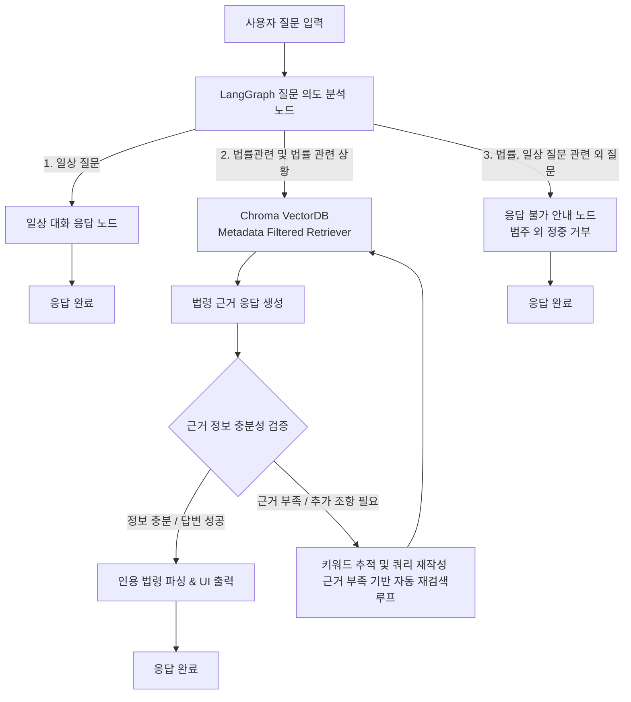

# 생활법률 질의응답 및 상황 기반 법령 안내 챗봇

## 📌 프로젝트 개요

### 프로젝트 소개
생활 속 법률 상황이나 법률 질문을 자연어로 입력하면, 적용 가능한 법령과 관련 조항을 안내하는 생활 밀착형 법률 정보를 제공하는 챗봇을 구현했습니다.

에이전트는 일상생활 질문, 법률 관련 질문, 그 외 전문지식이 필요한 질문을 받을 수 있고 그에 맞는 적절한 답변을 하도록 통제했습니다.

LangGraph를 활용해 이전에 실패한 키워드를 추적하여 LLM이 다른 법률 표준 용어로 쿼리를 재작성하게 만들었고, LLM이 지정한 추가 필요 조항을 검색하여 기존 컨텍스트에 누적하는 방식으로 재검색하도록 구현했습니다.

### 📚 데이터 소개 (국가법령정보센터)
- 개인정보 보호법 (법, 시행령, 시행규칙 등)
- 근로기준법 (법, 시행령, 시행규칙 등)
- 도로교통법 (법, 시행령, 시행규칙 등)
- 전자상거래 등에서의 소비자보호에 관한 법률
- 주택임대차보호법

### 🛠️ 기술 스택
- **AI/LLM**: LangGraph, LangChain, OpenAI (`gpt-4o-mini`), BAAI (`bge-m3`)
- **Vector DB**: Chroma DB
- **Data Processing**: PyMuPDF (`fitz`), Regex, JSON
- **Frontend/UI**: Streamlit

---

## ✨ 주요 기능

1. **상황 기반 의도 분석 및 메타데이터 필터링 (Intent Classification & Metadata Filtering)**
   - 사용자 질문 및 이전 대화 맥락(History)을 종합 분석하여 질문의 의도를 3가지 경로(일상 질문 / 법률 관련 질문 / 법률·일상 외 범주 질문)로 구분합니다.
   - 법률 질문 시 해당 질문이 속한 상위 법령(`parent_law`), 세부 구분(`law_category`: 법, 시행령, 시행규칙 등), 조항 번호(`article_no`)를 파싱하여 Vector DB 검색 시 **동적 메타데이터 필터링**을 적용합니다.

2. **LangGraph 기반 Self-RAG 및 피드백 재검색 루프 (Adaptive Search Loop)**
   - 검색된 문맥만으로 답변 작성이 불가능하거나(`IDK`), LLM이 특정 추가 조항(`NEED_MORE: 조항명`)을 요구할 경우 자동으로 재검색 상태로 전환됩니다.
   - 이전 검색 시 실패했던 키워드(`tried_keywords`)를 누적 관리하며, LLM이 표준 법률 용어로 검색 쿼리를 자동 재작성합니다.
   - 새롭게 검색된 법령 정보를 기존 컨텍스트에 누적(`Context Accumulation`)하여 답변의 정밀도를 향상시킵니다 (최대 3회 반복).

3. **환각(Hallucination) 방지 및 법령 근거 인용 (Evidence-based Citation)**
   - 제공된 검색 법령 원문만을 근거로 답변을 작성하도록 LLM 프롬프트를 엄격히 제약합니다.
   - 답변에서 실제로 참조한 조항 번호(`USED_LAWS`)를 추적하고 정규표현식으로 정제하여, 사용자 UI에 **인용된 법령 원문**만 돋보기(Expander) 형태로 명확히 제공합니다.

4. **범위 외 질문 정중 거부 (Out-of-Scope Guardrails / 응답 불가)**
   - 주 서비스 대상(생활 법률 5대 법령)을 벗어난 형법/민법 상담, 불법행위 조장, 일반 전문 지식(요리법, 과학 등) 질문에는 "제가 도움을 드릴 수 있는 범위를 벗어난 질문입니다"와 같이 정중한 답변 거부 안내를 제공하여 챗봇의 정체성을 유지합니다.

5. **다중 대화 세션 관리 (Multi-Session Management UI)**
   - Streamlit 기반의 직관적인 웹 인터페이스를 통해 대화 세션 생성, 대화 제목 수정, 대화 삭제 및 세션별 독립적인 대화 기록 관리를 지원합니다.

---

## 🔄 시스템 동작 방식 (Workflow)

### 세부 처리 흐름
1. **[질문 의도 분석]**
   - 질문과 대화 기록을 분석하여 **① 일상질문**, **② 법률관련 질문**, **③ 법률/일상 외 질문(범위 외)** 으로 의도를 구분합니다.
   - 법률 질문인 경우 `parent_law`, `law_category`, `article_no`, `keywords`를 파싱합니다.
2. **[일상 질문 처리]**
   - 인사 및 일반 대화 질문에 대해 가벼운 대화 응답을 제공합니다.
3. **[법률 관련 처리 (RAG & 재검색 루프)]**
   - `BAAI/bge-m3` 임베딩 및 동적 메타데이터 필터 기반으로 Chroma DB에서 관련 조항을 검색합니다 (`k=6`).
   - 검색된 근거 법령 원문(`[1]`, `[2]`...)에 기반하여 조항 명시 답변을 생성합니다.
   - 정보가 부족하거나 추가 조항이 필요한 경우(`IDK`, `NEED_MORE`), 실패 키워드(`tried_keywords`)를 우회한 쿼리 재작성 후 **자동 재검색 루프**를 실행합니다.
4. **[법률/일상 외 질문 처리 (응답 불가)]**
   - 형법/민법 등 타 분야 법률, 불법행위 조장, 과학/요리 등 전문지식 질문 시 가드레일에 의해 범위 외 안내("제가 도움을 드릴 수 있는 범위를 벗어난 질문입니다")를 출력합니다.
5. **[결과 정제 및 시각화]**
   - `USED_LAWS` 태그를 정규식으로 파싱하여 실제 답변에 쓰인 법령 원문만 `st.expander`로 시각화합니다.
